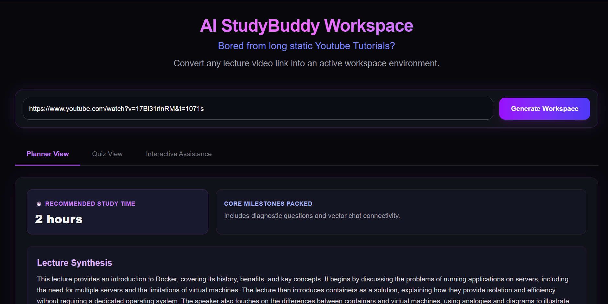
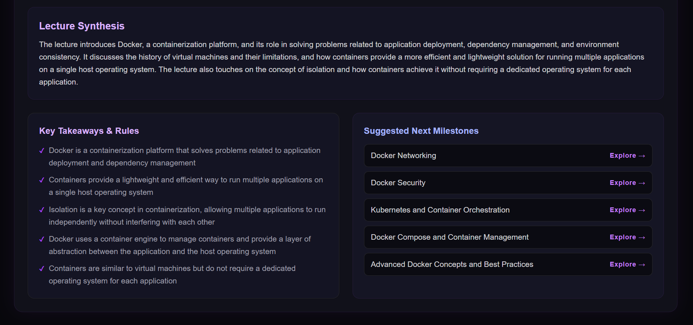
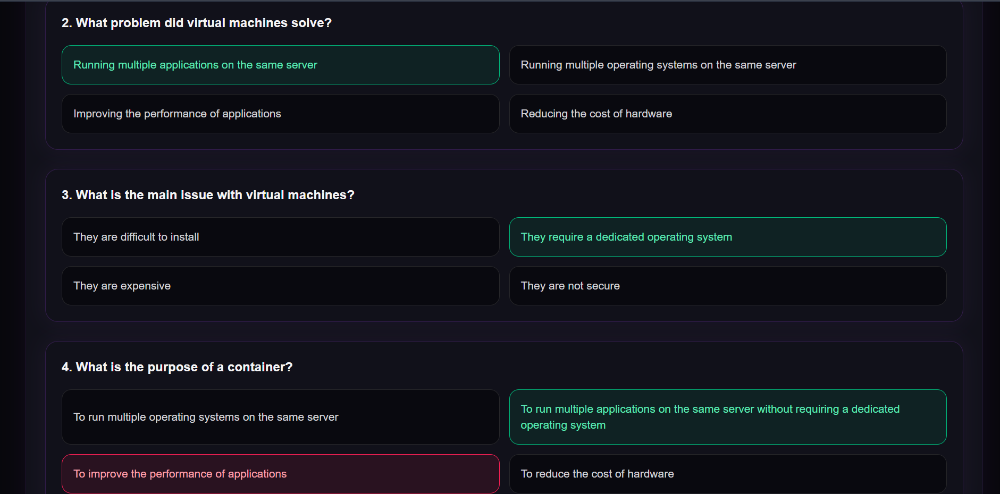
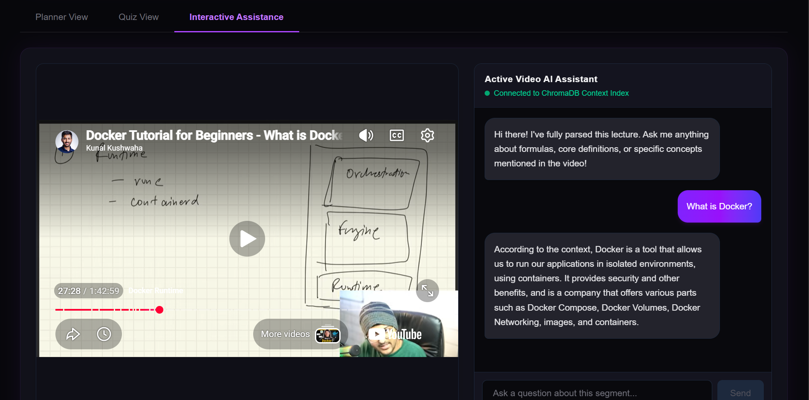

# AI StudyBuddy

An advanced, full-stack AI-driven educational platform that transforms static lecture videos into interactive, dynamic learning environments. Built with a highly user friendly frontend, the application automatically indexes video transcripts to generate comprehensive lesson summaries, dynamic quiz assessments, and an interactive context-aware AI co-pilot.

---

## Key Features

*   **Premium Dark UI Dashboard:** Features a clean, accessible layout featuring high-fidelity styling built with Tailwind CSS.
*   **Lecture Synthesis & Roadmap:** Replaces arbitrary timeline segments with an AI-generated academic overview, review time allocation budget, and a curated key takeaways panel.
*   **Dynamic Knowledge Assessment:** Generates customized multiple-choice questions with real-time semantic feedback loops (correct options highlight in emerald; incorrect choices flash in rose).
*   **Interactive AI Assistance:** A vector-indexed contextual assistant sitting side-by-side with an embedded YouTube stream player, allowing students to query specifics across long-form lectures.
*   **Auto-Curriculum Exploration:** Every suggested forward topic features an automated external search component mapping directly into live YouTube search indexes via encoded URI protocols.

---

## 🛠️ Technology Stack

### Frontend Canvas
*   **React.js (Vite)** — Single Page Application structural foundation.
*   **Tailwind CSS** — Declarative layout and interaction engines.
*   **PostCSS & Autoprefixer** — Cross-browser style parsing automation.

### Backend Infrastructure
*   **FastAPI** — High-performance execution router framework.
*   **LangChain** — LLM chaining architecture and document loader ecosystem.
*   **ChatGroq model: llama-3.3-70b-versatile** — Structured JSON schematic execution layer.
*   **ChromaDB** — Local standalone vector database instance storage (`data/chroma_db`).

---

## 📁 Project Structure

```text
ai-studybuddy/
├── backend/
│   ├── app/
│   │   ├── main.py             # FastAPI core engine and global CORS router config
│   │   └── services/
│   │       ├── videoprocessor.py # YouTube Loader and transcript parsing
│   │       ├── quizgen.py       # Pydantic structured quiz generation logic
│   │       └── planner.py       # Synthesis, takeaways, and milestone recommendations
│   ├── .env                    # System environmental authentication keys
│   └── requirements.txt        # Python library dependencies
│
└── frontend/
    ├── src/
    │   ├── features/
    │   │   ├── Dashboard.jsx    # Central nexus orchestrator 
    │   │   ├── StudyPlanner.jsx # Study Roadmap and YouTube redirect links
    │   │   ├── QuizDashboard.jsx# Real-time evaluation button state matrix
    │   │   └── VideoChat.jsx    # Stream player & context-aware chat logs 
    │   ├── App.jsx             # Top-level viewport element loader
    │   └── index.css           # Global Tailwind compiler directive configurations
    ├── tailwind.config.js      # Workspace utility routing scanner
    └── package.json            # Node package configurations
```
---
## 📸 Model in Action

Below are the interface states of the AI StudyBuddy Workspace processing an active lecture vector index:

### 1. Active Dashboard Entry


### 2. Synthesis & Curriculum Planner View


### 3. Dynamic Knowledge Assessment (Quiz)


### 4. Vector Contextual AI Assistance Chat
